# Marketplace Project Architecture

## Architecture Diagram

```mermaid
graph TD
    %% Client Side
    Client[Client Browser] --> AngularFE[Angular Frontend]
    
    %% Frontend Components
    subgraph "Frontend - Angular"
        AngularFE --> AdminModule[Admin Module]
        AngularFE --> PagesModule[Pages Module]
        AngularFE --> GuardModule[Guard Module]
        AngularFE --> ServicesModule[Services Module]
        
        %% Admin Components
        AdminModule --> CategoryList[Category Management]
        AdminModule --> CouponList[Coupon Management]
        AdminModule --> CustomerList[Customer Management]
        AdminModule --> Dashboard[Admin Dashboard]
        AdminModule --> OrderList[Order Management]
        AdminModule --> ProductList[Product Management]
        
        %% Pages Components
        PagesModule --> HomePage[Home Page]
        PagesModule --> CartPage[Shopping Cart]
        PagesModule --> ProductPage[Product Details]
        PagesModule --> LibraryPage[User Library]
        PagesModule --> LoginPage[Login Page]
        PagesModule --> SignupPage[Signup Page]
        PagesModule --> PaymentPage[Payment Page]
        PagesModule --> DeliveryAddressPage[Delivery Address]
        
        %% Guards
        GuardModule --> AuthGuard[Auth Guard]
        GuardModule --> AdminGuard[Admin Guard]
        GuardModule --> AuthInterceptor[Auth Interceptor]
        
        %% Services
        ServicesModule --> ProductService[Product Service]
        ServicesModule --> CategoryService[Category Service]
        ServicesModule --> CustomerService[Customer Service]
        ServicesModule --> OrderService[Order Service]
        ServicesModule --> CartService[Cart Service]
        ServicesModule --> AddressService[Address Service]
        ServicesModule --> CouponService[Coupon Service]
        ServicesModule --> KeycloakService[Keycloak Service]
    end
    
    %% Backend Components
    subgraph "Backend - Spring Boot"
        SpringApp[Spring Boot Application] --> Controllers[REST Controllers]
        SpringApp --> Services[Service Layer]
        SpringApp --> Repositories[Repository Layer]
        SpringApp --> Entities[Entity Models]
        SpringApp --> Security[Security Config]
        
        %% Controllers
        Controllers --> ProductResource[Product Resource]
        Controllers --> CategoryResource[Category Resource]
        Controllers --> CustomerResource[Customer Resource]
        Controllers --> OrderResource[Order Resource]
        Controllers --> AddressResource[Address Resource]
        Controllers --> CouponResource[Coupon Resource]
        Controllers --> ProxyResource[Proxy Resource]
        
        %% Services
        Services --> ProductServiceBE[Product Service]
        Services --> CategoryServiceBE[Category Service]
        Services --> CustomerServiceBE[Customer Service]
        Services --> OrderServiceBE[Order Service]
        Services --> AddressServiceBE[Address Service]
        Services --> CouponServiceBE[Coupon Service]
        
        %% Entities
        Entities --> ProductEntity[Product]
        Entities --> CategoryEntity[Category]
        Entities --> CustomerEntity[Customer]
        Entities --> OrderEntity[Order]
        Entities --> OrderItemEntity[OrderItem]
        Entities --> AddressEntity[Address]
        Entities --> CouponEntity[Coupon]
        
        %% Repositories
        Repositories --> ProductRepo[Product Repository]
        Repositories --> CategoryRepo[Category Repository]
        Repositories --> CustomerRepo[Customer Repository]
        Repositories --> OrderRepo[Order Repository]
        Repositories --> OrderItemRepo[OrderItem Repository]
        Repositories --> AddressRepo[Address Repository]
        Repositories --> CouponRepo[Coupon Repository]
    end
    
    %% Infrastructure Components
    subgraph "Infrastructure - Kubernetes"
        K8s[Kubernetes Cluster] --> AngularDeployment[Angular Deployment]
        K8s --> SpringDeployment[Spring Boot Deployment]
        K8s --> PostgresDeployment[PostgreSQL Deployment]
        K8s --> KeycloakDeployment[Keycloak Deployment]
        
        PostgresDeployment --> PostgresPVC[PostgreSQL PVC]
        KeycloakDeployment --> KeycloakVolume[Keycloak Volume]
    end
    
    %% Connections between components
    AngularFE <--> SpringApp
    SpringApp <--> PostgresDeployment
    AngularFE <--> KeycloakDeployment
    SpringApp <--> KeycloakDeployment
```

## System Components

### Frontend (Angular)
- **Admin Module**: Management interfaces for administrators
- **Pages Module**: User-facing pages for shopping and account management
- **Guard Module**: Authentication and authorization guards
- **Services Module**: API communication services

### Backend (Spring Boot)
- **REST Controllers**: API endpoints for frontend communication
- **Service Layer**: Business logic implementation
- **Repository Layer**: Data access layer
- **Entity Models**: Domain objects representing business entities
- **Security Config**: Authentication and authorization configuration

### Infrastructure (Kubernetes)
- **Angular Deployment**: Frontend application container
- **Spring Boot Deployment**: Backend application container
- **PostgreSQL Deployment**: Database server with persistent storage
- **Keycloak Deployment**: Identity and access management server

### Key Features
- Digital marketplace for products (physical and digital)
- User authentication and authorization via Keycloak
- Shopping cart functionality
- Order processing and management
- Product library for digital products
- Admin dashboard for product, category, and order management
- Coupon system for discounts

### Data Flow
1. Users interact with the Angular frontend
2. Frontend communicates with Spring Boot backend via REST APIs
3. Backend processes requests and interacts with PostgreSQL database
4. Authentication and authorization handled by Keycloak
5. Digital products are stored and delivered to users' libraries
