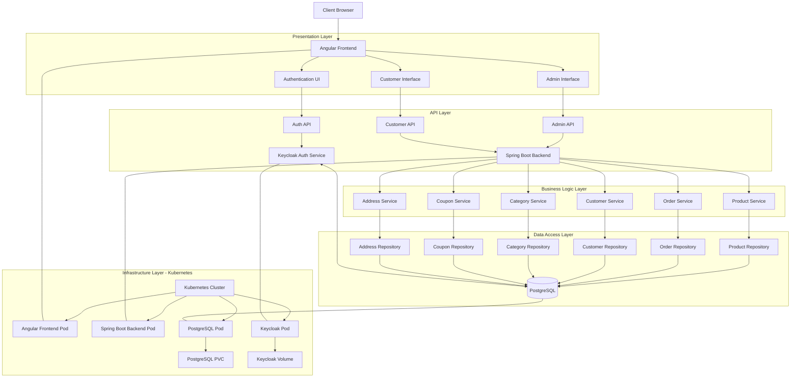

# Marketplace Project Architecture

## General Architecture Diagram

## Core Components

### Frontend (Angular)
- **Admin Interface**: Management dashboards for products, categories, customers, orders, and coupons
- **Customer Interface**: Product browsing, shopping cart, digital library, and account management
- **Authentication UI**: Login, signup, and user profile management

### Backend (Spring Boot)
- **REST Controllers**: API endpoints for all business operations
- **Service Layer**: Business logic implementation
- **Repository Layer**: Data access interfaces
- **Entity Models**: Domain objects (Product, Order, Customer, etc.)
- **Security Config**: JWT-based authentication with Keycloak integration

### Data Model
- **Products**: Physical and digital items for sale
- **Categories**: Product classification system
- **Customers**: User accounts with personal information
- **Orders**: Purchase records with items and status
- **Coupons**: Discount codes for orders
- **Addresses**: Shipping locations for physical products

### Infrastructure (Kubernetes)
- **Angular Deployment**: Frontend container with Nginx
- **Spring Boot Deployment**: Backend API container
- **PostgreSQL Deployment**: Database with persistent storage
- **Keycloak Deployment**: Identity and access management

## Key Features
- Digital marketplace supporting both physical and digital products
- User authentication and authorization via Keycloak
- Shopping cart and checkout flow
- Order processing and management
- Digital product library for purchased downloads
- Admin dashboard for inventory and order management
- Coupon system for discounts and promotions

## Data Flow
1. Users authenticate through Keycloak
2. Frontend Angular app communicates with Spring Boot backend via REST APIs
3. Backend processes business logic and persists data in PostgreSQL
4. Digital products are delivered to users' libraries after purchase
5. Admins manage inventory, orders, and customers through dedicated interfaces
