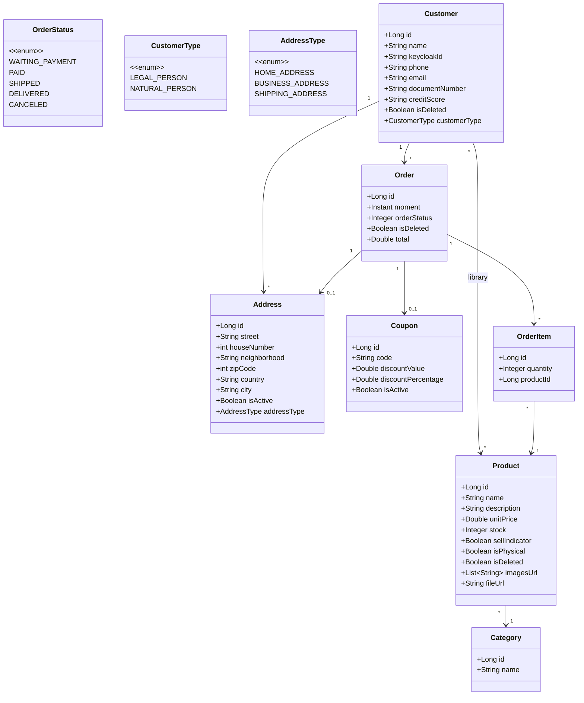

```mermaid
classDiagram
    direction TB

    class OrderStatus {
        &lt;&lt;enum&gt;&gt;
        WAITING_PAYMENT
        PAID
        SHIPPED
        DELIVERED
        CANCELED
    }
    class CustomerType {
        &lt;&lt;enum&gt;&gt;
        LEGAL_PERSON
        NATURAL_PERSON
    }
    class AddressType {
        &lt;&lt;enum&gt;&gt;
        HOME_ADDRESS
        BUSINESS_ADDRESS
        SHIPPING_ADDRESS
    }
    class Customer {
        +Long id
        +String name
        +String keycloakId
        +String phone
        +String email
        +String documentNumber
        +String creditScore
        +Boolean isDeleted
        +CustomerType customerType
    }
    class Product {
        +Long id
        +String name
        +String description
        +Double unitPrice
        +Integer stock
        +Boolean sellIndicator
        +Boolean isPhysical
        +Boolean isDeleted
        +List~String~ imagesUrl
        +String fileUrl
    }
    class Order {
        +Long id
        +Instant moment
        +Integer orderStatus
        +Boolean isDeleted
        +Double total
    }
    class Address {
        +Long id
        +String street
        +int houseNumber
        +String neighborhood
        +int zipCode
        +String country
        +String city
        +Boolean isActive
        +AddressType addressType
    }
    class Category {
        +Long id
        +String name
    }
    class Coupon {
        +Long id
        +String code
        +Double discountValue
        +Double discountPercentage
        +Boolean isActive
    }
    class OrderItem {
        +Long id
        +Integer quantity
        +Long productId
    }

    Customer "1" --> "*" Order
    Customer "1" --> "*" Address
    Customer "*" --> "*" Product : library
    Order "1" --> "0..1" Address
    Order "1" --> "0..1" Coupon
    Order "1" --> "*" OrderItem
    OrderItem "*" --> "1" Product
    Product "*" --> "1" Category
```